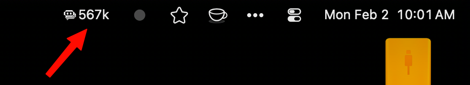

# Check Poe API balance remaining in the menu bar

A SwiftBar/xbar plugin and command-line tool to display your remaining Poe API balance. Works in the MacOS menu bar or terminal.

## Find the API key

To use this tool, define your Poe API key by adding the following line to your `.bashrc` or `.zshrc` (depending on your shell):  

    export POE_API_KEY="your-API-key-here"

You can find your API key by [going here](https://poe.com/api_key).

## SwiftBar / xbar Integration

This includes a [SwiftBar](https://github.com/swiftbar/SwiftBar) (also xbar) plugin to display your remaining Poe balance in the MacOS menu bar. It can display the balance in one of the following ways:


`Poe: 670k` ← actual points remaining


`Poe: 67%` ← percentage remaining

`Poe: 670k (Est.: 720k)` ← (a) actual points remaining and (b) expected points today assuming the user consumes the same amount of points everyday throughout the month. When a billing cycle is configured, the estimate is based on the balance first observed for that cycle, so users who start the month above `1M` keep accurate estimates. "Est." can be useful to judge if you are overspending your points.

  
`Poe: 67% (Est.: 72%)` ← same as above in percentage

When a billing cycle is configured, the dropdown menu shows additional details:

```
Day 12 of 30 (18 days until renewal)
Cycle start balance: 1.5M
Expected balance now: 908k (91%)
Daily burn: 27.5k (expected: 49.3k)
Projected end balance: 675k
```

### Installing and configuring the SwiftBar plugin

(1) Install [SwiftBar](https://github.com/swiftbar/SwiftBar) (can be installed with Homebrew: `brew install swiftbar`).  

(2) Place `poe_balance.30m.sh` in your SwiftBar plugins folder.  

(3) Change the following variables in `poe_balance.30m.sh` to define how you would like the menu app to behave.  

*To display balance as percentage:*

```shell
#<xbar.var>boolean(VAR_PERCENT="true"): Display remaining balance as percentage.</xbar.var>
```
(set it to `false` to display actual points).

*To display the estimated points remaining today assuming average use*, change this line:

```shell
#<xbar.var>number(VAR_STARTING_DATE="21"): Billing period starting date (1-31). Set to 0 to disable cycle tracking.</xbar.var>
```
For example, the line above defines the starting of the billing period in the 21st of each month.

When billing-cycle tracking is enabled, the plugin stores the first balance it sees for each cycle in `~/Library/Application Support/poe-balance/cycle_state` and uses that value for:

- expected balance now
- daily burn
- projected end balance

If SwiftBar was not running when the cycle renewed, the plugin falls back to the first balance it observes later in that same cycle and notes that in the dropdown.

*To keep the menu bar minimal* (show only the current balance, with billing cycle details in the dropdown only):

```shell
#<xbar.var>boolean(VAR_MINIMAL_MENUBAR="false"): Keep menu bar minimal (current balance only) even when a billing cycle is configured?.</xbar.var>
```
Set to `true` to display just `67%` or `670k` in the menu bar regardless of `VAR_STARTING_DATE`, while still showing the full cycle breakdown in the dropdown.

## Output

Points are displayed in human-readable format:

| Range | Example |
|------|-------|
| < 1,000 | `500` |
| 1,000 - 999,999 | `150k` |
| 1,000,000 - 999,999,999 | `1.5M` |
| 1B+ | `1.2B` |

## More SwiftBar plugins by the author

Small, glanceable menu bar utilities that stay out of the way until you need them:

- **[claude_code](../claude_code/)** — Claude Code usage limits (5h, 7d windows) at a glance.
- **[copilot-usage-tracker](../copilot-usage-tracker/)** — GitHub Copilot premium request usage and monthly pacing.
- **[weather](../weather/)** — Current conditions, temperature, humidity, and wind — no API key required.
